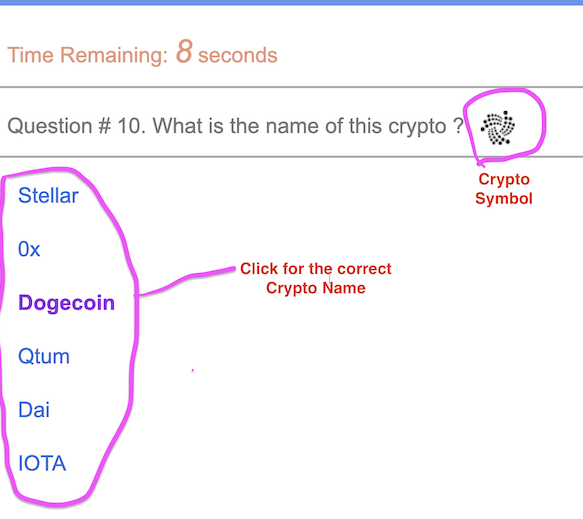

# Crypto Awareness Quiz

[click here to play](https://jasonjpeng.github.io/TriviaGame/)

### This game is to help you recognize the crypto currency symbols

There are thousnads of cryptocurrencies. This game gives you 10 crypto symbols and you need to click
one of the 6 choices whthin 10 seconds. After making your choice, the game will display to correct answer to you. 
After finishing the 10 questions, yiu can click the button to restart. The game will would show you 10 different crypto symbols again.

Note: The symbols and crypto currency names are selected from CoinMarketCap 

